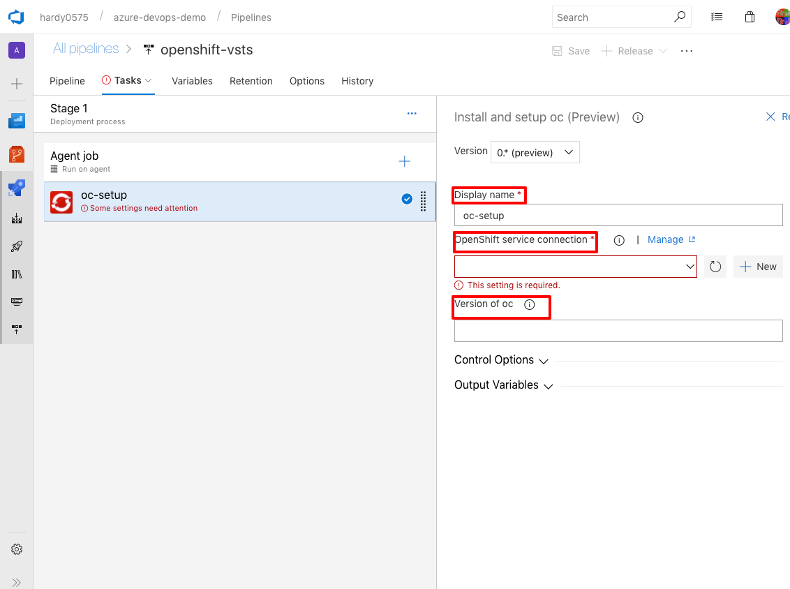

# Getting started

The OpenShift extension for Azure DevOps allows you to connect and interact with an [OpenShift](https://www.okd.io/) cluster as part of your build or release pipeline.
The following paragraphs guide you through the process of using this extension.

<!-- MarkdownTOC autolink="true" autoanchor="true" -->

- [Prerequisite](#prerequisite)
  - [Configuring the OpenShift service connection](#configuring-the-openshift-service-connection)
- [Pipeline Tasks](#pipeline-tasks)
  - [Install and setup oc](#install-and-setup-oc)
  - [Executing single oc commands](#executing-single-oc-commands)
  - [Updating a ConfigMap](#updating-a-configmap)

<!-- /MarkdownTOC -->


<a id="prerequisite"></a>
## Prerequisite

<a id="configuring-the-openshift-service-connection"></a>
### Configuring the OpenShift service connection

To use any of the pipeline tasks, you first need a way to connect to your cluster.
In Azure DevOps, access to external and remote services is configured in [service connections](https://docs.microsoft.com/en-us/azure/devops/pipelines/library/service-endpoints?view=vsts).
Azure DevOps comes with a built-in connection for Kubernetes, the [Kubernetes service connection](https://docs.microsoft.com/en-us/azure/devops/pipelines/library/service-endpoints?view=vsts#sep-kuber).
Since Kubernetes and OpenShift use the same authentication mechanism, we can leverage this existing service connection for our purposes.
The image below shows where you can find it.

 

First, select the project's settings (cogwheel icon).
From there choose _Service connections_, followed by _New service connection_.
In the appearing dialogue you need to enter the following information:

<dl>
  <dt>Connection Name</dt>
  <dd>Required. The name you will use to refer to this service connection in task properties of the OpenShift execute task.</dd>
  <dt>Server URL</dt>
  <dd>Required. The URL of the Kubernetes/Openshift cluster.</dd>
  <dt>Kubeconfig</dt>
  <dd>The contents of the kubectl configuration file.</dd>  
</dl>

Once you have specified all the required information, you can verify it using the _verify connection_ link.
If your connection is working, you are ready to go.

<a id="pipeline-tasks"></a>
## Pipeline Tasks 

The following paragraphs describe each of the provided pipeline tasks and their use. 

<a id="install-and-setup-oc"></a>
### Install and setup oc

The most generic task is the _Install and setup oc_ task.
This task allows you to install a specific version of the OpenShift CLI (`oc`).
The installed binary matches the OS of your agent.
The task also adds `oc` to the `PATH` and creates a kubeconfig file for authentication against the OpenShift cluster.

After adding and configuring a _Install and setup oc_ task in your pipeline, you can use `oc` directly within your _Command Line_ task, for example:


To add the _Install and setup oc_ task to your pipeline, select the _+_ next to the agent job.
You can filter the appearing task list by searching for _Install oc_.
Add the _Install and setup oc_ task to your pipeline using the _Add_ button.


Once added, you need to edit the following configuration options:



<dl>
  <dt>Display name</dt>
  <dd>The name displayed in the task list, eg "Install oc".</dd>
  <dt>OpenShift service connection</dt>
  <dd>Required. The service connection to use to execute this command. See <a href="#configuring-the-openshift-service-connection">Configuring the OpenShift service connection</a>.</dd>
  <dt>Version of oc to use</dt>
  <dd>Allows to specify the version of oc to use, eg v3.10.0. If left blank the latest stable version is used. You can also specify a direct URL to a oc release bundle.</dd>  
</dl>

---

<a id="executing-single-oc-commands"></a>
### Executing single oc commands

In case you want to execute a single `oc` command you can use the _Execute OpenShift command_ task.

To add this task, select the _+_ to add a task to your pipeline.
You can filter the appearing task list by searching for _Execute oc command_.
Add the _Execute oc command_ task to your pipeline using the _Add_ button.


The _Execute oc command_ has four configuration options.


<dl>
  <dt>Display name</dt>
  <dd>The name displayed in the task list, eg "Rollout".</dd>
  <dt>OpenShift service connection</dt>
  <dd>Required. The service connection to use to execute this command. See <a href="#configuring-the-openshift-service-connection">Configuring the OpenShift service connection</a>.</dd>
  <dt>Version of oc to use</dt>
  <dd>Allows to specify the version of oc to use for command execution, eg v3.10.0. If left blank the latest stable version is used. You can also specify a direct URL to the oc release bundle.</dd>  
  <dt>Command to run</dt>
  <dd>The actual oc command to run starting with the oc sub-command, eg "rollout latest dc/my-app -n production".</dd>
</dl>


It is possible to use variables defined in the agent.
For example, to reference a file in the artefact _my_sources you could do:

```bash
apply -f ${SYSTEM_DEFAULTWORKINGDIRECTORY}/_my_sources/my-openshift-config.yaml`
```


In case you are reaching the GitHub API rate limit, you can set GITHUB_ACCESS_TOKEN as a pipeline variable.
To create a GitHub access token refer to <a href="https://help.github.com/articles/creating-a-personal-access-token-for-the-command-line/">Creating a personal access token for the command line</a>.

---

<a id="updating-a-configmap"></a>
### Updating a ConfigMap

An even more specific task offered by this extension is the _Update ConfigMap_ task.
It allows you to update the properties of a given ConfigMap using a grid.

To add this task, select the _+_ to add a task to your pipeline.
You can filter the appearing task list by searching for _Update ConfigMap_.
Add the _Update ConfigMap_ task to your pipeline using the _Add_ button.


The _Update ConfigMap_ task has six configuration options.


<dl>
  <dt>Display name</dt>
  <dd>The name displayed in the task list, eg "Rollout latest".</dd>
  <dt>OpenShift/Kubernetes service connection</dt>
  <dd>Required. The service connection to use to execute this command. See <a href="#configuring-the-openshift-service-connection">Configuring the OpenShift service connection</a>.</dd>
  <dt>Version of oc to use</dt>
  <dd>Allows to specify the version of oc to use for command execution, eg v3.10.0. If left blank the latest stable version is used. You can also specify a direct URL to the oc release bundle.</dd>  
  <dt>Name of ConfigMap</dt>
  <dd>Required.The name of the ConfigMap to update.</dd>
  <dt>Namespace of ConfigMap</dt>
  <dd>The namespace in which to find the ConfigMap. The current namespace is used if none is specified.</dd>
  <dt>ConfigMap Properties</dt>
  <dd>The properties to set/update. Only the properties which need creating/updating need to be listed. Space separated values need to be surrounded by quotes ("). </dd>  
</dl>


It is possible to use variables defined in the agent.
For example, to reference a variable MY_VAR defined in the pipeline configuration, you can use ${MY_VAR} as the property value.
