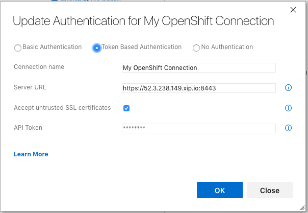
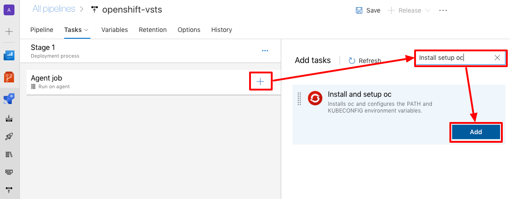
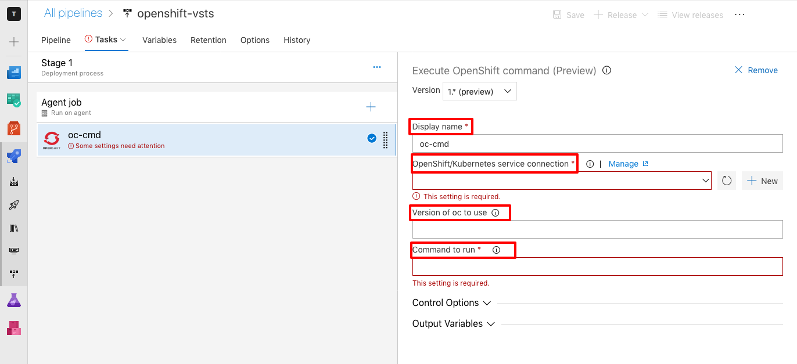
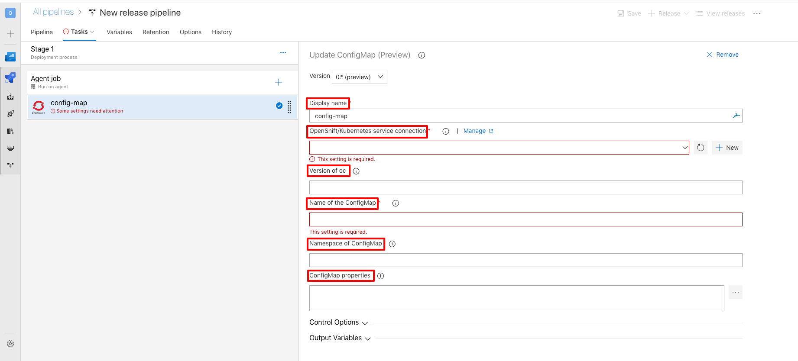

# Getting started

The OpenShift extension for Azure DevOps allows you to connect and interact with an [OpenShift](https://www.okd.io/) cluster as part of your build or release pipeline.
The following paragraphs guide you through the process of using this extension.

<!-- MarkdownTOC autolink="true" autoanchor="true" -->

- [Configuring the OpenShift service connection](#configuring-the-openshift-service-connection)
  - [Basic Authentication](#basic-authentication)
  - [Token Authentication](#token-authentication)
  - [Kubeconfig](#kubeconfig)
- [Pipeline Tasks](#pipeline-tasks)
  - [Install and setup oc](#install-and-setup-oc)
  - [Executing single oc commands](#executing-single-oc-commands)
  - [Updating a ConfigMap](#updating-a-configmap)
- [YAML configuration](#yaml-configuration)

<!-- /MarkdownTOC -->

<a id="connect-to-your-openshift-cluster"></a>
## Connect to your OpenShift cluster

To use any of the pipeline tasks, you first need a way to connect to your cluster.
In Azure DevOps, access to external and remote services is configured in [service connections](https://docs.microsoft.com/en-us/azure/devops/pipelines/library/service-endpoints?view=vsts).
The OpenShift extension for Azure DevOps provides two ways to set up a connection: <a href="#configuring-the-openshift-service-connection">create a custom OpenShift service connection type <a> which allows you to connect to your cluster using various authentication forms or <a href="#setup-the-openshift-connection-runtime">by defining it at Task level</a> when creating your pipeline.


<a id="configuring-the-openshift-service-connection"></a>
## Configuring the OpenShift service connection

To configure an OpenShift connection, select the project settings (cogwheel icon).
From there choose _Service connections_, followed by _New service connection_.
Select the OpenShift service connection and use one of the following methods to configure authentication:

<a id="basic-authentication"></a>
### Basic Authentication


<dl>
  <dt>Server URL</dt>
  <dd>Required. The URL of the Openshift cluster.</dd>
  <dt>Username</dt>
  <dd>Required. OpenShift username.</dd>
  <dt>Password</dt>
  <dd>Required. Password for the specified user.</dd>      
  <dt>Accept untrusted SSL certificates</dt>
  <dd>Whether it is ok to accept self-signed (untrusted) certificated.</dd>  
  <dt>Certificate Authority File</dt>
  <dd>The path where the certificate authority file is stored.</dd>
  <dt>Service Connection Name</dt>
  <dd>Required. The name you will use to refer to this service connection.</dd>
  <dt>Grant Access permission to all pipelines</dt>
  <dd>Allow all pipelines to use this connection. It allows YAML defined pipeline, which are not automatically authorized for service connections, to use this service connection.</dd>
</dl>


<a id="token-authentication"></a>
### Token Authentication



<dl>
  <dt>Server URL</dt>
  <dd>Required. The URL of the Openshift cluster.</dd> 
  <dt>Accept untrusted SSL certificates</dt>
  <dd>Whether it is ok to accept self-signed (untrusted) certificated.</dd>  
  <dt>Certificate Authority File</dt>
  <dd>The path where the certificate authority file is stored.</dd>
  <dt>API Token</dt>
  <dd>Required.The API token used for authentication.</dd>  
  <dt>Service Connection Name</dt>
  <dd>Required. The name you will use to refer to this service connection.</dd>
  <dt>Grant Access permission to all pipelines</dt>
  <dd>Allow all pipelines to use this connection. It allows YAML defined pipeline, which are not automatically authorized for service connections, to use this service connection.</dd>
</dl>

<a id="kubeconfig"></a>
### Kubeconfig


<dl>
  <dt>Server URL</dt>
  <dd>Required. The URL of the Openshift cluster.</dd> 
  <dt>Kubeconfig</dt>
  <dd>The contents of the kubectl configuration file.</dd> 
  <dt>Service Connection Name</dt>
  <dd>Required. The name you will use to refer to this service connection.</dd>
  <dt>Grant Access permission to all pipelines</dt>
  <dd>Allow all pipelines to use this connection. It allows YAML defined pipeline, which are not automatically authorized for service connections, to use this service connection.</dd>
</dl>

---

_**Note:** In version 1.\* of this extension the Azure DevOps built-in [Kubernetes service connection](https://docs.microsoft.com/en-us/azure/devops/pipelines/library/service-endpoints?view=vsts#sep-kuber) was used.
If you want to you keep using this service connection you need to select the 1.* version when configuring a task._

---

<a id="setup-the-openshift-connection-runtime"></a>
## Set up the OpenShift connection on runtime

To set up an OpenShift connection on runtime, select the _Set Up Configuration on Runtime_ option in the _Service connection type_ .
You should be displayed with two options: File Path and Inline Configuration.

- File Path allows you to add a path where the agent will find the config file to use during the execution


- Inline Configuration expects you to copy the content of your config. The extension will create a new config file with the content inserted


<a id="pipeline-tasks"></a>
## Pipeline Tasks 

The following paragraphs describe each of the provided pipeline tasks and their use. 

Based on the options used, a task could need cURL to download the oc bundle requested. 
Each task assumes that cURL is already installed on the Agent that is running the build. 
If cURL is not located on the Agent, an error will be thrown, and the task will fail.

<a id="install-and-setup-oc"></a>
### Install and setup oc

The most generic task is the _Install and setup oc_ task.
This task allows you to install a specific version of the OpenShift CLI (`oc`).
The installed binary matches the OS of your agent.
The task also adds `oc` to the `PATH` and creates a kubeconfig file for authentication against the OpenShift cluster.

After adding and configuring a _Install and setup oc_ task in your pipeline, you can use `oc` directly within your _Command Line_ task, for example:


To add the _Install and setup oc_ task to your pipeline, select the _+_ next to the agent job.
You can filter the appearing task list by searching for _Install oc_.
Add the _Install and setup oc_ task to your pipeline using the _Add_ button.



Once added, you need to edit the following configuration options:


<dl>
  <dt>Display name</dt>
  <dd>The name displayed in the task list, eg "Install oc".</dd>
  <dt>OpenShift service connection</dt>
  <dd>Required. The service connection to use to execute this command. See <a href="#configuring-the-openshift-service-connection">Configuring the OpenShift service connection</a>.</dd>
  <dt>Version of oc to use</dt>
  <dd>Allows to specify the version of oc to use, eg v3.10.0. If left blank the latest stable version is used. You can also specify a direct URL to a oc release bundle.</dd>  
  <dt>Proxy</dt>
  <dd>Allows to specify a proxy (host:port) to use to download oc cli</dd>
</dl>

---

<a id="executing-single-oc-commands"></a>
### Executing single oc commands

In case you want to execute a single `oc` command you can use the _Execute OpenShift command_ task.

To add this task, you can filter the appearing task list by searching for _Execute oc command_.
The _Execute oc command_ has six configuration options.



<dl>
  <dt>Service Connection Type</dt>
  <dd>Required. The service connection to use to execute this command. See <a href="#configuring-the-openshift-service-connection">Configuring the OpenShift service connection</a>.</dd>
  <dt>Version of oc to use</dt>
  <dd>Allows to specify the version of oc to use for command execution, eg v3.10.0. If left blank the latest stable version is used. You can also specify a direct URL to the oc release bundle. See <a href="#how-the-cache-works">_How the cache works_</a></dd>  
  <dt>Command to run</dt>
  <dd>The actual oc command to run starting with the oc sub-command, eg "rollout latest dc/my-app -n production".</dd>
  <dt>Ignore on success return value</dt>
  <dd>It ignores non success return value from the current step and keep executing the pipeline if it fails. If you are executing a step which contains command like create/delete/patch but the resource has already been created/deleted/patched the pipeline could fail. By checking this option this error will be skipped and the execution will keep going.</dd>
  <dt>Use local oc executable</dt>
  <dd>It forces the extension to use, if present, the oc cli found in the machine where the agent is running. If no version is specified, the extension will use the local oc cli no matter its version is. If a version is specified then the extension will first check if the oc cli installed has the same version requested by the user, if not the correct oc cli will be downloaded.</dd>
  <dt>Proxy</dt>
  <dd>Allows to specify a proxy (host:port) to use to download oc cli</dd>
</dl>

---

_**Note:** It is possible to use variables defined in the agent.
For example, to reference a file in the artefact \_my\_sources you could do:_

```bash
apply -f ${SYSTEM_DEFAULTWORKINGDIRECTORY}/_my_sources/my-openshift-config.yaml
```

---

---

_**Note:** The extension supports pipe (|) operators. Due to the limitation of Azure library the extension only support one single pipe per command. The pipe operator also allow to use a different ToolRunner than oc (i.e grep - the tool must be visible to the extension).

```
oc describe pod/nodejs-ex | grep kubernetes
```

---

---

_**Note:** The extension supports redirector (>, >>, 2>) operators. The redirector operator expect a valid path as argument. 

<dl>
  <dd>> (write): create the file if it does not exist and write on it. If it exists, its content will be overwritten.</dd>
  <dd>>> (append): append text to the file</dd>
  <dd>2> (write stderr): redirect stderr to a file</dd>
</dl>

```
oc describe pod/nodejs-ex | grep kubernetes > /path/log.txt
```

---

<a id="updating-a-configmap"></a>
### Updating a ConfigMap

An even more specific task offered by this extension is the _Update ConfigMap_ task.
It allows you to update the properties of a given ConfigMap using a grid.

To add this task, select the _+_ to add a task to your pipeline.
You can filter the appearing task list by searching for _Update ConfigMap_.
Add the _Update ConfigMap_ task to your pipeline using the _Add_ button.


The _Update ConfigMap_ task has six configuration options.



<dl>
  <dt>OpenShift/Kubernetes service connection</dt>
  <dd>Required. The service connection to use to execute this command. See <a href="#configuring-the-openshift-service-connection">Configuring the OpenShift service connection</a>.</dd>
  <dt>Version of oc to use</dt>
  <dd>Allows to specify the version of oc to use for command execution, eg v3.10.0. If left blank the latest stable version is used. You can also specify a direct URL to the oc release bundle. See <a href="#how-the-cache-works">_How the cache works_</a></dd>  
  <dt>Name of ConfigMap</dt>
  <dd>Required.The name of the ConfigMap to update.</dd>
  <dt>Namespace of ConfigMap</dt>
  <dd>The namespace in which to find the ConfigMap. The current namespace is used if none is specified.</dd>
  <dt>ConfigMap Properties</dt>
  <dd>The properties to set/update. Only the properties which need creating/updating need to be listed. Space separated values need to be surrounded by quotes ("). </dd>
  <dt>Use local oc executable</dt>
  <dd>It forces the extension to use, if present, the oc cli found in the machine where the agent is running. If no version is specified, the extension will use the local oc cli no matter its version is. If a version is specified then the extension will first check if the oc cli installed has the same version requested by the user, if not the correct oc cli will be downloaded.</dd>
  <dt>Proxy</dt>
  <dd>Allows to specify a proxy (host:port) to use to download oc cli</dd>
</dl>

---

_**Note:** It is possible to use variables defined in the agent.
For example, to reference a variable MY_VAR defined in the pipeline configuration, you can use ${MY_VAR} as the property value._

<a id="yaml-configuration"></a>
## YAML configuration

You can also use the tasks of the OpenShift extension as part of a YAML defined pipeline.
The following configuration shows an example for each of the provided tasks:


```yaml
jobs:
- job: myjob
  displayName: MyJob
  pool:
    vmImage: 'vs2017-win2016'
  steps:
  # Install oc so that it can be used within a 'script' or bash 'task'
  - task: oc-setup@2
    displayName: Setup oc
    inputs:
      openshiftService: 'my_openshift_connection'
  # A script task making use of 'oc'    
  - script: |
      oc new-project my-project
      oc apply -f ${SYSTEM_DEFAULTWORKINGDIRECTORY}/openshift/config.yaml -n my-project
    displayName: 
  # Single shot 'oc' command
  - task: oc-cmd@2
    displayName: Wait for deployment
    inputs:
      openshiftService: 'my_openshift_connection'
      cmd: 'rollout status -w deployment/my-app'
  # Updating an existing ConfigMap
  - task: config-map@2
    displayName: Update ConfigMap
    inputs:
      openshiftService: 'my_openshift_connection'
      configMapName: 'my-config'
      namespace: 'my-project'
      properties: '-my-key1 my-value1 -my-key2 my-value2'
```

_**Note:** With Azure DevOps YAML defined pipelines are currently only available for build pipelines.
Configuration as code for release pipelines is under development.
See [here](https://stackoverflow.com/questions/52323065/azure-devops-yaml-release-pipelines) and [here](https://dev.azure.com/mseng/Azure%20DevOps%20Roadmap/_workitems/edit/1221170)._


